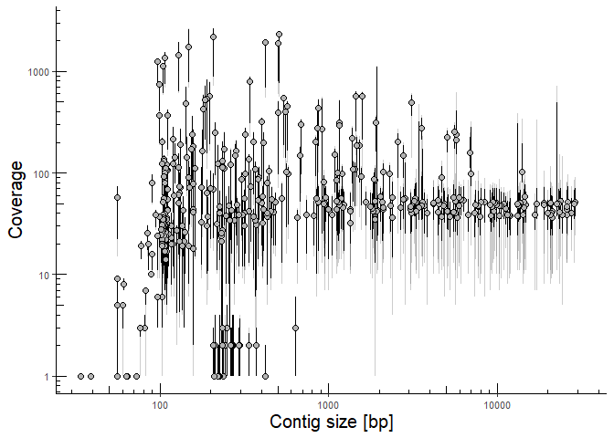

<!-- README.md is generated from README.Rmd. Please edit that file -->

# heidel

<!-- badges: start -->

<!-- badges: end -->

This packages is just some random functions that are used for very
specific tasks during my study. It is only to share with collaborators
and between workstations.

## Installation

Install package using devtools

``` r
if(!require("devtools")) install.packages("devtools")
library(devtools)
devtools::install_github("SorenHeidelbach/heidel")
```

# Usage examples

## count\_unique

``` r
library(heidel)

counted = count_unique(iris, 
                       subset_by = "Species", 
                       count_col = 1)
head(counted)
#>   Sepal.Length setosa versicolor virginica
#> 1          4.9      1          1         4
#> 2          5.6      1          5         0
#> 3          5.7      1          5         2
#> 4          5.8      3          3         1
#> 5          5.9      1          2         0
#> 6            6      2          4         0
species <- iris$Species[c(1,60)]
counted = count_unique(iris, 
                       subset_by = "Species", 
                       count_col = "Sepal.Length",
                       subset_values = species)
head(counted)
#>   Sepal.Length setosa versicolor
#> 1          4.9      1          4
#> 2            5      2          8
#> 3          5.1      1          8
#> 4          5.2      1          3
#> 5          5.4      1          5
#> 6          5.5      5          2
```

## tax\_lineage\_from\_accesion

``` r
tax_lineage_from_accesion(accession = c("NZ_CP027599.1", "NR_042763"))
#>           rank       NZ_CP027599.1           NR_042763
#> 8 superkingdom            Bacteria            Bacteria
#> 4      kingdom                <NA>                <NA>
#> 6       phylum      Proteobacteria      Proteobacteria
#> 1        class Gammaproteobacteria Alphaproteobacteria
#> 5        order    Enterobacterales    Rhodospirillales
#> 2       family  Enterobacteriaceae    Acetobacteraceae
#> 3        genus         Escherichia    Komagataeibacter
#> 7      species                coli           rhaeticus

tax_lineage_from_accesion(accession = c("NZ_CP027599.1", "7"),
                          custom_tax = c("clade", "genus", "species"))
#>       rank NZ_CP027599.1            7
#> 1    clade          <NA> Opisthokonta
#> 15   genus   Escherichia          Bos
#> 16 species          coli       taurus
```

## evaluate\_contig\_coverage

``` r
# Some large contigs have been removed from depth file to reduce file size.
evaluate_contig_coverage(path = "depth.AF1_seqtk.filt.txt", 
                         parametric = T) 
```



``` r

evaluate_contig_coverage(path = "depth.AF1_seqtk.filt.txt", 
                         parametric = F) 
```


